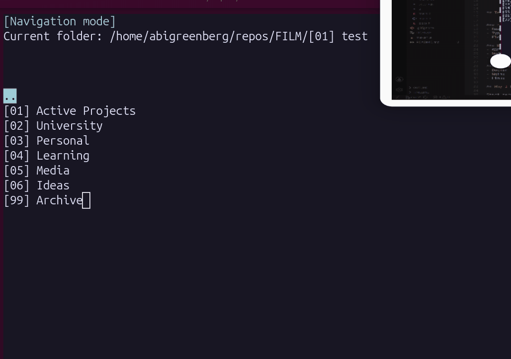
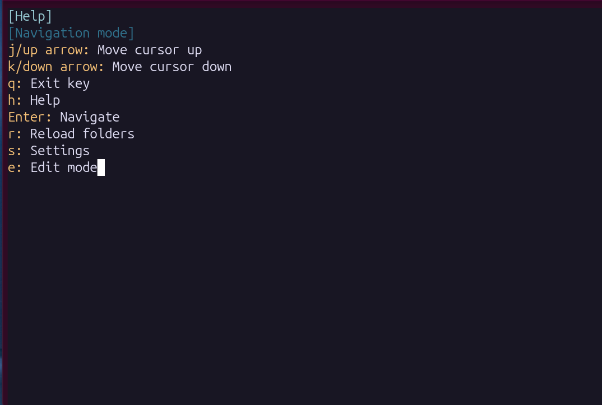
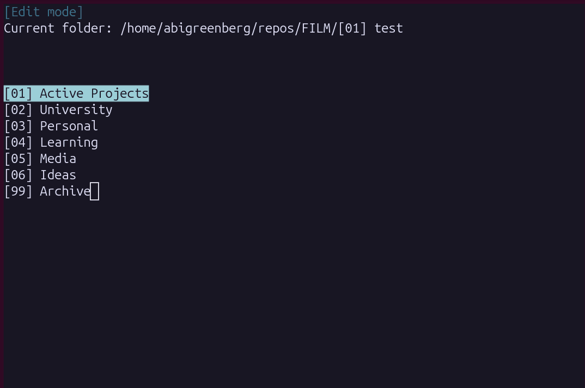
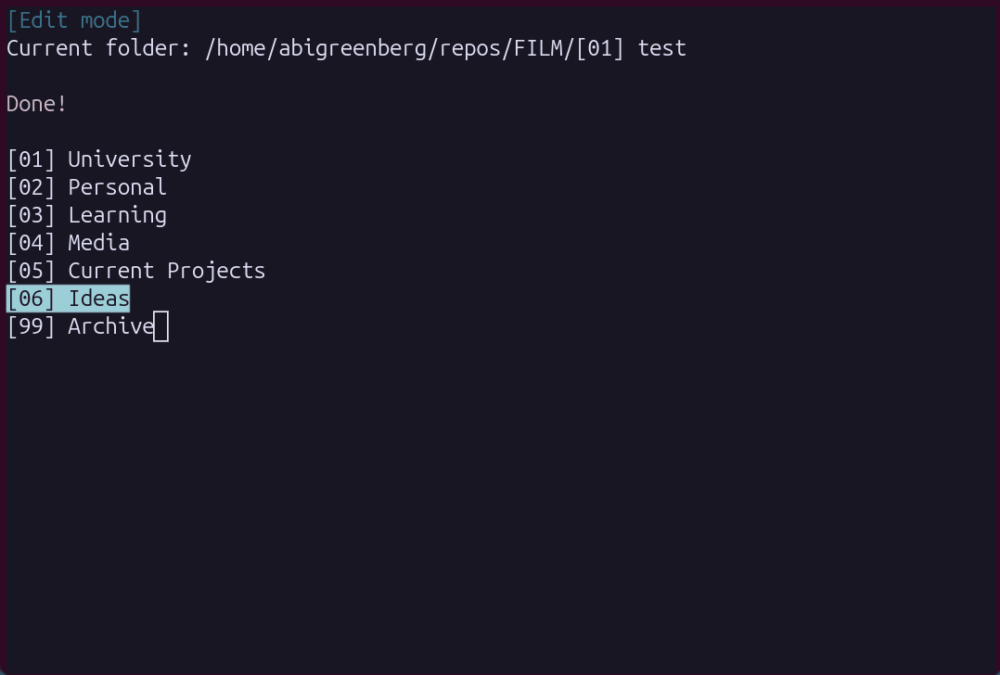
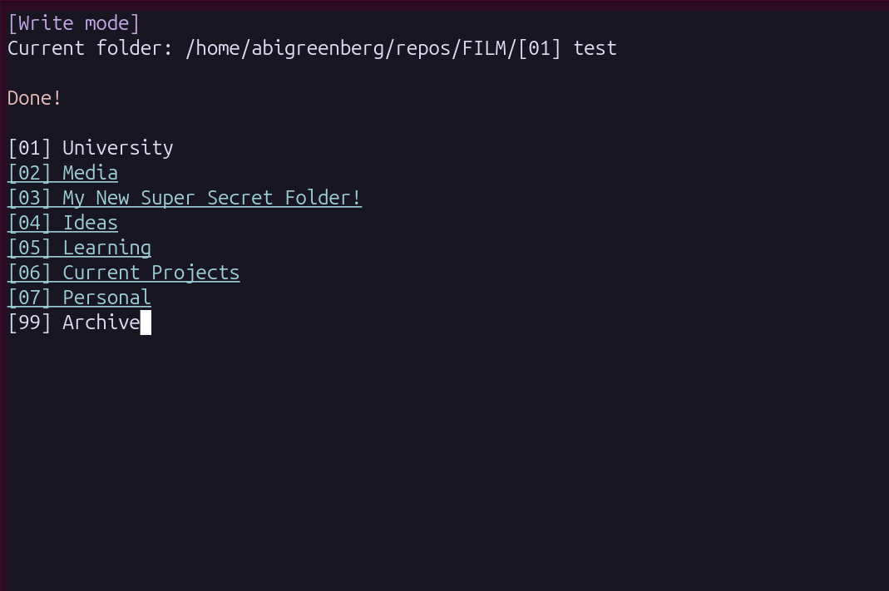

# FILM

FILM is a terminal-based file manager built with C and ncurses. It organizes directories using a strict priority-based naming system and provides a safe, staged-edit workflow, themes, and keyboard-driven navigation for efficient management of large folder structures.


*Example of the file structure in FILM*

## Highlights

* Built entirely in C using ncurses
* Safe staged-edit workflow before filesystem changes
* Custom diff engine using bitflag-based change tracking
* Configurable keybindings and themes
* Binary settings persistence with backward compatibility

## Features

* Follows bespoke naming convention optimized to maintain file organization
* Multiple modes in order to distinguish product functionalities:
  * View mode - Allows for simple navigation of a file structure that follows the required format.
  * Edit mode is the most powerful, letting users create, rename, rearrange, reorder, and manage folders.
  * Write mode - Allows the user to confirm file changes made in Edit mode in a “diff-style” in order to preview any major changes.
* The interface features an intuitive folder structure and simple keyboard shortcuts.
* Fully customizable settings menu, allowing custom shortcuts and a selection of interface themes (visual styles for the program).

## Tech Stack

* C
* Make
* ncurses

## Why I Built This

This section makes projects feel authentic instead of tutorial-based.

This project was inspired by a [video](https://www.youtube.com/watch?v=MM-MPS57qKA) that highlights simple file management strategies. The video’s premise was on using folder names prefaced by and sorted by a numerical priority. For example [01] Documents, [02] Media, etc...

This project helped me develop a fundamental understanding of Linux file systems, UI design, and building interfaces in C. The result is software I find extremely useful and use daily to organize my files.

## Screenshots

### File Explorer

*Navigating with Film*


*The help menu in explorer mode*

### Edit Mode

*Changing the order of folders in edit mode*


*Creating a folder in eit mode*

### Write Mode

*A diff shown in write mode*

## Architecture / Design

### Project Structure

```
src/
├── main.c / main.h        # entry point, all shared state, main loop
├── opts.h                 # constants (max path lengths, buffer sizes, etc.)
├── backend/
│   ├── folders.c/h        # folder struct, name parsing, sorting
│   ├── files.c/h          # all filesystem I/O, including reading directories and writing changes
│   └── diff.c/h           # staged edit system
├── ui/
│   ├── ui.c/h             # ncurses rendering
│   ├── controls.c/h       # keyboard input + keybind resolution
│   └── help.c/h           # help overlay
└── settings/
    ├── settings.c/h       # settings struct with tagged union values
    ├── colours.c/h        # color theme management
    ├── save_settings.c/h  # read/write settings to disk
    ├── settings_ui.c/h    # settings screen rendering
    └── settings_controls.c/h
```


* [main.c](src/main.c) manages shared state, including the current path, active mode, folder list, and pending edits. All states are passed by pointer, avoiding global variables.

## Staged Edits: Key Design Decision

* In Edit mode, changes are not made to the filesystem right away. Instead, all edits are staged in a Diff array that matches the real folder list.
* Each diff entry uses bit flags `(NAME, ARCHIVE, CREATE)` to track changes. This way, if a folder is renamed or reordered, it only appears once in the diff.
* Write mode shows a preview by underlining folders that will be renamed and highlighting those marked for archiving. The program only runs `rename()` or `mkdir()` after you confirm the changes.
* This two-step process lets you make and cancel multiple edits before saving anything to disk, preventing accidental loss.

### Other Decisions Worth Noting

* `isValidFolderName()` checks for the `[NN] Name` format and extracts the numeric sort key `(NN)`, which determines folder order. Names that do not match are silently filtered out. Both the plain name (Documents) and the formatted name ([01] Documents) are saved for filesystem use.
* The program loads all color themes at startup. Rather than reinitializing ncurses colors every time you switch themes, it pre-registers all themes with a `(theme_id, color_role)` index. You can switch themes instantly without reinitialization.
* The settings system saves everything as a binary file at `~/.film/settings.dat`. A settings_count header at the start lets you add new settings later without breaking existing configuration files.

## Challenges & Lessons Learned

### Known Bugs

* Bug: If a folder is created and archived (i.e., it doesn’t exist yet, but the user wants to cancel its creation), the folder is still created
  * Expected behavior: The folder should not be created
  * Potential fix: Add a special clause to write_changed in [`backend/files.c`](src/backend/files.c) to handle this case.

### Refactoring

* Introducing the settings menu required significant refactoring. Previously hard-coded keyboard controls became modifiable, mainly involving [`ui/controls.c`](src/ui/controls.c).
* Adding color themes required a major rewrite, which was finally resolved by loading colors from memory at program startup.

### Things I would like to improve

* Currently, the UI can be a little unintuitive, and the program lacks text descriptions of what users can do in FILM itself. I plan to improve the UI’s ease of use, so first-time users benefit greatly.
* A major overhaul I would like to complete is adding a setting that supports more naming conventions. This could be a string that the user defines in the settings menu. For example, the default naming string would look something like `[NN] NAME`.
  * Important factors to consider:
    * With more substitutions, it is more difficult to identify patterns in folder structures. For example, let's say the pattern the user set is `[NN] NAME YY`, and the folder name is [01] My Documents 06, perhaps the 06 at the end fits the format, and the folder was created in 06, or maybe the name of the folder is My Documents 06
    * FILM is currently designed to load and handle only folders that match the pattern in use. If the ability to change the pattern is added and the user changes the pattern, that will exclude all their existing folders. For example, if the user currently uses [NN] NAME and changes it to NN_NAME, then every existing folder will not be recognized by that.
  * Potential workarounds:
    * We ignore the fact that existing folders will be excluded in the name of greater customisability (some users will prioritize having that degree of customisability and prefer dealing with the headache of migrating their tools)
    * FILM could have an inbuilt tool to help migrate from old to new file structure names. This could be done automatically (when the user changes the settings) or via a manual entry in the FILM UI to activate at any time.


## Installation

Make sure you have [ncurses](https://invisible-island.net/ncurses/) installed beforehand. You might find [this guide](https://www.cyberciti.biz/faq/linux-install-ncurses-library-headers-on-debian-ubuntu-centos-fedora/) more helpful.

```bash
git clone https://github.com/abrahamgreenberg/FILM.git
cd FILM

### FOR RELEASE BUILD (view below for dev build)

# 1. Clean directory
make clean

# 2. Build 
make release

# 3. Install
make install 

# 4. Check that it is installed correctly, "film" should be in the user's local bin
ls ~/bin

# 5. If ~/bin is added to your path, open a new shell and run:
film

### FOR DEV BUILD

### WARNING: THE DEV BUILD IS A MORE UNLOCKED VERSION OF FILM. IT ALLOWS FOR NAVIGATION TO THE ROOT OF YOUR SYSTEM, WHICH CAN BE DANGEROUS. IT IS THEREFORE REMOVED FROM THE MAIN RELEASE OF FILM. PROCEED WITH CAUTION

# 1. Clean directory
make clean

# 2. Build
make debug

# 3. Run FILM
./bin/film_debug
```